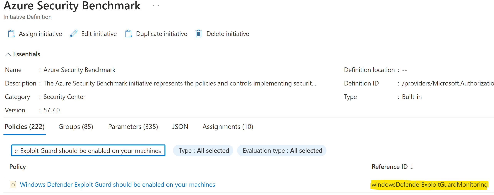

1. In the Policy blade, select Assigments from the left menu and make  
    sure you have the scoping correct.  
    
2. Search for the Assignment Name or Subscription and then select the  
    name of the assignment.  
    
3. From the Initiative Assignment blade, select the “View definition”  
    button on the top of the blade.  
    
4. Search for the Policy in question, the Reference Id will be visible  
    from here  
    
    
     d