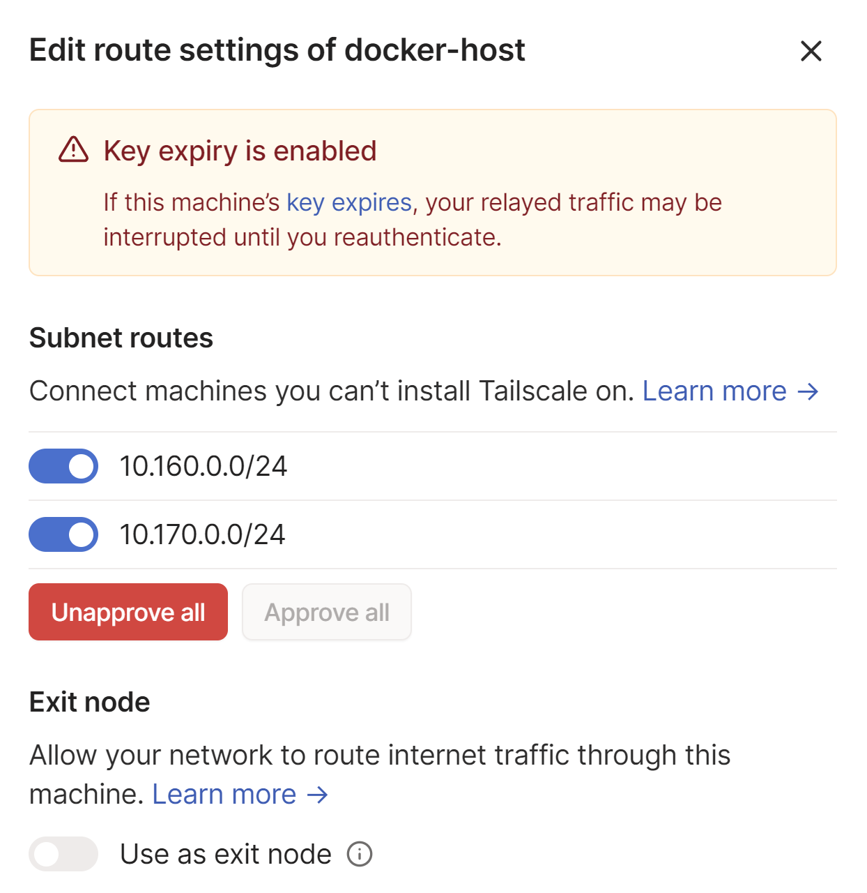

## CPU quota flag

[Don’t Build Docker Apps Without This Flag - DEV Community](https://dev.to/code42cate/dont-build-docker-apps-without-this-flag-48kg)

## Enable TCP port 2375 for external connection to Docker  

See this [issue](https://github.com/moby/moby/issues/25471).

Docker best practise to [Control  
and configure Docker with systemd  
](https://docs.docker.com/engine/admin/systemd/\#/custom-docker-daemon-options).

1. Create `daemon.json` file in `/etc/docker`:

```Plain
{"hosts": ["tcp://0.0.0.0:2375", "unix:///var/run/docker.sock"]}
```

1. Create `/etc/systemd/system/docker.service.d` folder
2. Add `/etc/systemd/system/docker.service.d/override.conf`

```Plain
[Service]
ExecStart=
ExecStart=/usr/bin/dockerd
```

3. Reload the systemd daemon:

```Plain
sudo systemctl daemon-reload
```

4. Restart docker:

```Plain
sudo ystemctl restart docker.service
```

# Setup Tailscale container

1. Login to [Tailscale](https://login.tailscale.com/admin/settings/keys) and create a Auth key  

2. Configure the Docker VM to forward and masquerade traffic faccording to the tailscale setup guide: [Subnet routers and traffic relay nodes · Tailscale](https://tailscale.com/kb/1019/subnets/?tab=linux\#enable-ip-forwarding)

```Plain
echo 'net.ipv4.ip_forward = 1' | sudo tee -a /etc/sysctl.d/99-tailscale.conf echo 'net.ipv6.conf.all.forwarding = 1' | sudo tee -a /etc/sysctl.d/99-tailscale.conf sudo sysctl -p /etc/sysctl.d/99-tailscale.conf
```

1. Create tailscale.yaml file

```Plain
version: '3.8'
services:

  tailscaled:
    container_name: tailscale
    user: "0:0"
    privileged: true
    cap_add:
        - NET_ADMIN
    volumes:
        - '/nfs/docker/tailscale/settings:/var/lib'
        - '/dev/net/tun:/dev/net/tun'
    network_mode: "bridge"
    image: tailscale/tailscale
    command:
        - tailscaled
    restart: unless-stopped
    environment:
      - PUID=1000
      - PGID=1000
      - TS_USERSPACE=true
      - TS_AUTH_KEY="<TS_AUTH_KEY>"
      - TS_ROUTES=10.170.0.0/24,10.160.0.0/24
```

1. From the Docker VM run:

```Plain
sudo docker exec tailscale tailscale up --authkey="<TS_AUTH_KEY>"
```

From the Tailscale portal, If you don’t see your subnets listed under Machines, run: 

```Plain
sudo docker exec tailscale tailscale up --accept-routes --advertise-routes=10.160.0.0/24,10.170.0.0/24
```

1. You may need to Approve routes from the portal under docker-host    